# ACT07_Menu_Llista_filtre

## Documentació

### Introducció
En aquesta activitat s’han implementat dos **RecyclerView** per mostrar les llistes d’elements.  
L’objectiu és entendre el funcionament del patró **Adapter + ViewHolder**, la separació de responsabilitats dins del codi i la implementació de **filtres** per modificar la informació que es mostra a la llista.

## Què és un RecyclerView?

Un **RecyclerView** és un component que permet mostrar llistes o graelles d’elements de manera eficient.  
La seva principal característica és que **recicla les vistes** que ja no són visibles, evitant crear-ne de noves constantment i millorant el rendiment de l’aplicació.

Per utilitzar un RecyclerView cal:
- Una llista de dades (en memòria).
- Un layout XML per a la pantalla que conté el RecyclerView.
- Un layout XML per a cada fila.
- Un Adapter i un ViewHolder.

---

## Model de dades i font de dades

## Data class
Per representar cada element de la llista s’ha creat una `data class`:

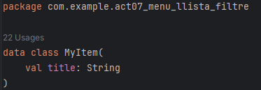

*Aquesta classe defineix la informació que es mostrarà a cada fila del RecyclerView.*

## Font de dades en memòria (object)

Les dades es guarden en un `object` de Kotlin que actua com un Singleton:

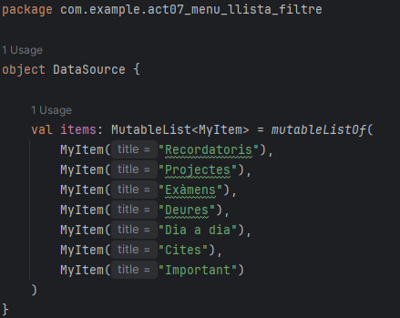

*Aquest objecte permet tenir una única instància de dades durant l'execució i accedir a la mateixa llista des de diferents pantalles.*

## Layout de cada element
Cada fila del RecyclerView es defineix en un layout XML independent:

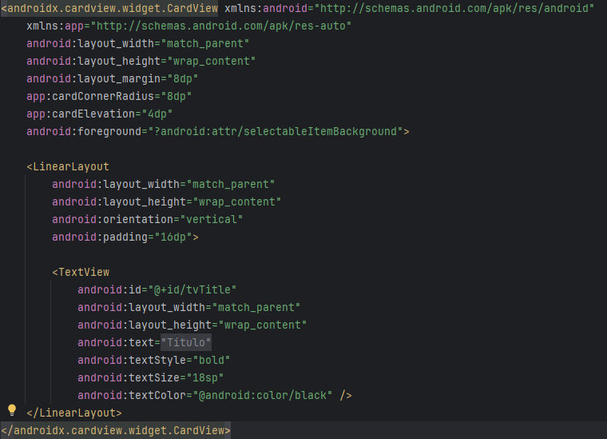
*Aquest layout defineix l'aspecte visual d'un sol element de la llista.*

## ViewHolder
El ViewHolder encapsula la vista d’una fila del RecyclerView i conté la lògica necessària per mostrar-hi les dades corresponents. En aquest projecte, el ViewHolder només gestiona un `TextView`, que mostra el títol de cada element.

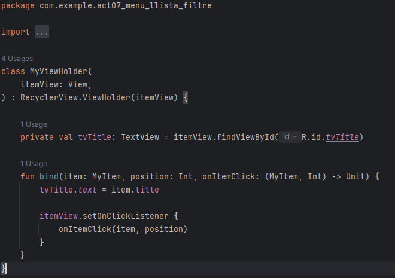

*Aquest ViewHolder rep la vista de la fila `itemView` i busca una sola vegada les referències a les seves sub-vistes, en aquest cas el `TextView`. El mètode `bind` és el punt central on s’assignen les dades de l’objecte `MyItem` a la interfície. També és aquí on es configura el listener de clic, que notifica quin element i quina posició s’ha seleccionat. D’aquesta manera, tota la lògica relacionada amb una fila concreta queda encapsulada dins del ViewHolder.*

## Adapter
L’Adapter actua com a intermediari entre la llista de dades i el RecyclerView. En aquest projecte, l’Adapter manté dues llistes: una amb totes les dades originals i una altra amb les dades filtrades que realment es mostren a la pantalla.

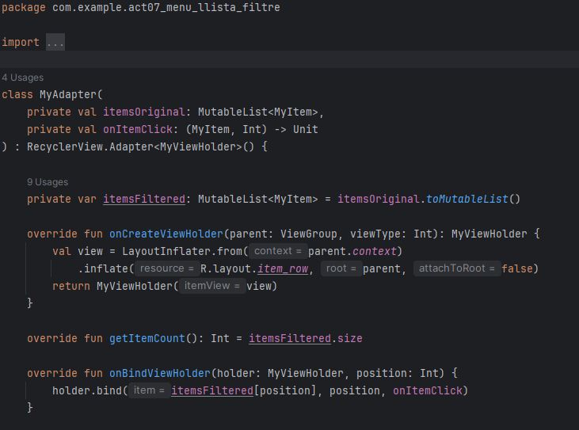

*L’Adapter s’encarrega de crear els ViewHolder inflant el layout XML de cada fila, d’indicar al RecyclerView quants elements ha de mostrar i de passar les dades corresponents a cada posició. Quan el RecyclerView necessita mostrar una fila, l’Adapter crida el mètode `bind` del ViewHolder, passant-li l’element correcte de la llista filtrada. Aquesta separació permet que l’Adapter no s’hagi de preocupar de com es mostren exactament les dades, sinó només de gestionar-les i proporcionar-les al ViewHolder. A més, el fet de treballar amb una llista filtrada independent permet implementar filtres sense perdre la llista original, facilitant que l’usuari pugui canviar entre diferents vistes de les dades de manera senzilla.*

---

# Filtre de Categories al RecyclerView

## Descripció
Implementació d'un sistema de filtratge per categories que permet a l'usuari filtrar els elements del RecyclerView segons la seva categoria.

---

## Pas 1: Afegir categoria al model de dades

### MyItem.kt
Hem modificat la classe `MyItem` per incloure un camp `category`:

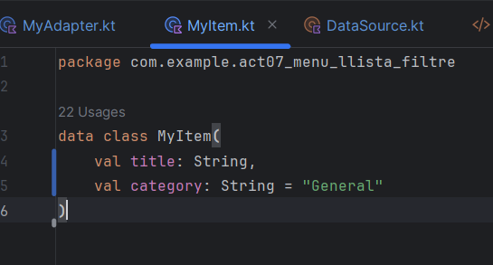

**Què fa:** Cada item ara té un títol i una categoria assignada.

---

## Pas 2: Actualitzar el DataSource amb categories

### DataSource.kt
Hem afegit categories a tots els items de prova:

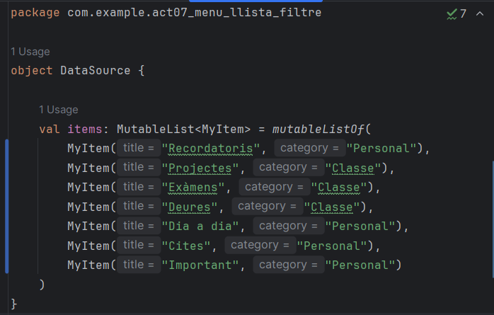

**Què fa:** Proporciona dades de prova organitzades per categories.

---

## Pas 3: Implementar la funció updateList() a l'Adapter

### MyAdapter.kt
Hem afegit el mètode `updateList()` que permet actualitzar la llista d'items mostrada:

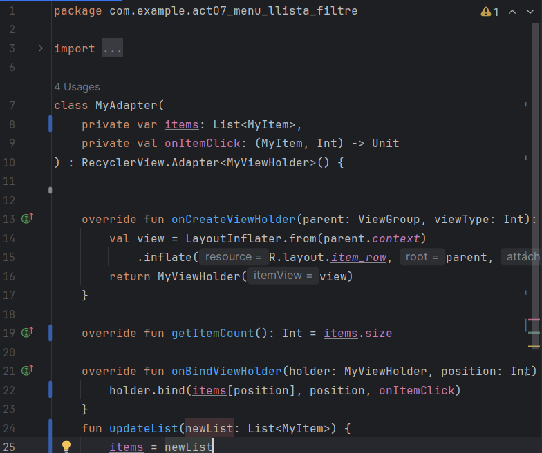
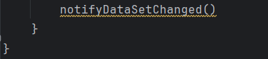

**Què fa:** 
- `updateList()` rep una nova llista d'items
- Reassigna la variable `items` amb la nova llista
- `notifyDataSetChanged()` notifica al RecyclerView que les dades han canviat i ha de redibuixar-se

---

## Pas 4: Crear el menú popup de categories

### res/menu/popup_categories.xml
Hem creat un fitxer XML amb les opcions del menú popup:

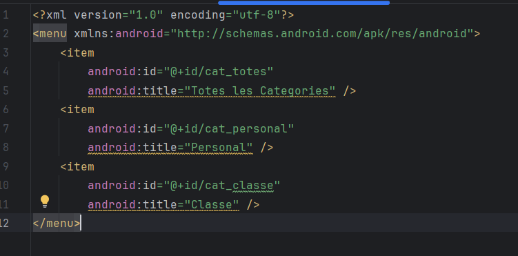

**Què fa:** Defineix les opcions que apareixeran al menú emergent.

---

## Pas 5: Afegir botó de filtre al menú de la Toolbar

### res/menu/main_menu.xml
Hem afegit un ítem al menú principal per obrir el filtre:

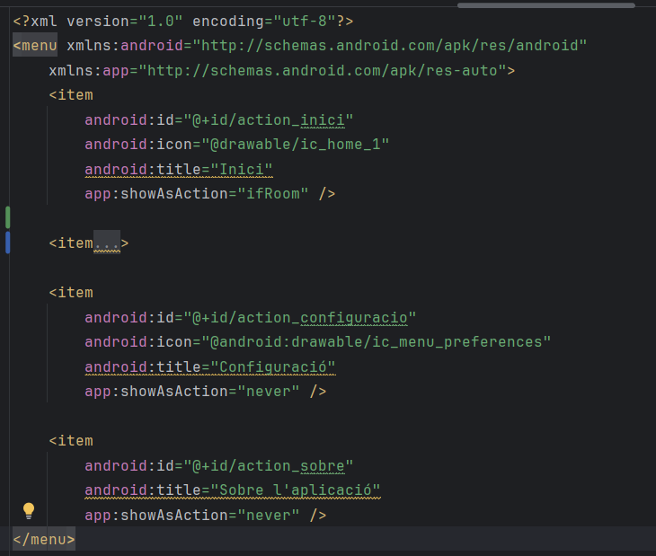

**Què fa:** Afegeix una icona a la Toolbar que obre el menú de categories.

---

## Pas 6: Implementar la lògica del filtre a l'Activity

### MainUserActivity.kt
Hem implementat tres funcions clau:
```kotlin
package com.example.act07_menu_llista_filtre

import android.content.Intent
import android.os.Bundle
import android.widget.Button
import androidx.appcompat.app.AppCompatActivity
import android.widget.Toast
import androidx.recyclerview.widget.LinearLayoutManager
import androidx.recyclerview.widget.RecyclerView
import androidx.appcompat.app.AlertDialog
import android.util.Log
import android.view.Menu
import android.view.MenuItem
import android.view.View
import android.widget.PopupMenu
import androidx.appcompat.widget.Toolbar
import androidx.core.content.ContextCompat

class MainUserActivity : AppCompatActivity() {
    private lateinit var btnTestNav: Button
    private lateinit var recyclerView: RecyclerView
    private lateinit var adapter: MyAdapter
    private lateinit var toolbar: Toolbar

    override fun onCreate(savedInstanceState: Bundle?) {
        super.onCreate(savedInstanceState)
        setContentView(R.layout.activity_main_user)
        setupToolbar()
        setupRecyclerView()
        initComponents()
        initListeners()
    }

    private fun setupToolbar() {
        toolbar = findViewById(R.id.my_toolbar)
        setSupportActionBar(toolbar)
        supportActionBar?.title = "TaskBuddy"
        toolbar.setTitleTextColor(ContextCompat.getColor(this, R.color.white))
    }

    override fun onCreateOptionsMenu(menu: Menu?): Boolean {
        menuInflater.inflate(R.menu.main_menu, menu)
        return true
    }

    override fun onOptionsItemSelected(item: MenuItem): Boolean {
        return when (item.itemId){
            R.id.action_inici -> {
                Toast.makeText(this, "Anant al Inici", Toast.LENGTH_SHORT).show()
                val intent = Intent(this, MainUserActivity::class.java)
                startActivity(intent)
                true
            }
            R.id.action_category_button -> {
                showCategoryPopupMenu(toolbar)
                true
            }
            R.id.action_configuracio -> {
                Toast.makeText(this, "Anant a configuració", Toast.LENGTH_SHORT).show()
                val intent = Intent(this, ConfigurationActivity::class.java)
                startActivity(intent)
                true
            }
            R.id.action_sobre -> {
                mostrarDialogSobre()
                true
            }
            else -> super.onOptionsItemSelected(item)
        }
    }

    private fun showCategoryPopupMenu(view: View) {
        val popup = PopupMenu(this, view)
        popup.menuInflater.inflate(R.menu.popup_categories, popup.menu)

        popup.setOnMenuItemClickListener { menuItem ->
            when (menuItem.itemId) {
                R.id.cat_totes -> {
                    applyCategoryFilter("Totes")
                    true
                }
                R.id.cat_personal -> {
                    applyCategoryFilter("Personal")
                    true
                }
                R.id.cat_classe -> {
                    applyCategoryFilter("Classe")
                    true
                }
                else -> false
            }
        }

        popup.show()
    }

    private fun applyCategoryFilter(category: String) {
        Toast.makeText(this, "Filtrat per: $category", Toast.LENGTH_SHORT).show()
        Log.d("Filter", "Categoria seleccionada: $category")

        val filteredList = if (category == "Totes") {
            DataSource.items
        } else {
            DataSource.items.filter { it.category == category }
        }

        adapter.updateList(filteredList)
    }

    private fun mostrarDialogSobre() {
        AlertDialog.Builder(this)
            .setTitle("Sobre l'aplicació")
            .setMessage("Aplicació que gestiona les tasques")
            .setPositiveButton("Tancar", null)
            .show()
    }

    private fun setupRecyclerView() {
        recyclerView = findViewById(R.id.rvLists)
        recyclerView.layoutManager = LinearLayoutManager(this)

        adapter = MyAdapter(DataSource.items){ item, position ->
            Toast.makeText(this, "Has seleccionat: ${item.title}", Toast.LENGTH_SHORT).show()
        }

        recyclerView.adapter = adapter
    }

    private fun initListeners() {
        btnTestNav.setOnClickListener {
            val intent = Intent(this, RegisterActivity::class.java)
            startActivity(intent)
        }
    }

    private fun initComponents() {
        btnTestNav = findViewById(R.id.btnTestNav)
    }
}
```

### TaskTodayActivity.kt

```kotlin
package com.example.act07_menu_llista_filtre

import android.content.Intent
import android.os.Bundle
import android.util.Log
import android.view.Menu
import android.view.MenuItem
import android.view.View
import android.widget.PopupMenu
import android.widget.Toast
import androidx.appcompat.app.AlertDialog
import androidx.appcompat.app.AppCompatActivity
import androidx.appcompat.widget.Toolbar
import androidx.recyclerview.widget.LinearLayoutManager
import androidx.recyclerview.widget.RecyclerView

class TasksTodayActivity : AppCompatActivity() {

    private lateinit var toolbar: Toolbar
    private lateinit var recyclerView: RecyclerView
    private lateinit var adapter: MyAdapter

    override fun onCreate(savedInstanceState: Bundle?) {
        super.onCreate(savedInstanceState)
        setContentView(R.layout.activity_tasks_today)

        setupToolbar()
        setupRecyclerView()
    }

    private fun setupToolbar() {
        toolbar = findViewById(R.id.my_toolbar)
        setSupportActionBar(toolbar)
        supportActionBar?.title = "Les Meves Tasques"
    }

    private fun setupRecyclerView() {
        recyclerView = findViewById(R.id.rvListToday)
        recyclerView.layoutManager = LinearLayoutManager(this)

        adapter = MyAdapter(DataSource.items) { item, position ->
            handleItemClick(item, position)
        }

        recyclerView.adapter = adapter
    }

    // Inflar el menú
    override fun onCreateOptionsMenu(menu: Menu?): Boolean {
        menuInflater.inflate(R.menu.main_menu, menu)
        return true
    }

    // Gestionar clics del menú
    override fun onOptionsItemSelected(item: MenuItem): Boolean {
        return when (item.itemId) {
            R.id.action_inici -> {
                Toast.makeText(this, "Anant a Inici", Toast.LENGTH_SHORT).show()
                val intent = Intent(this, MainUserActivity::class.java)
                startActivity(intent)
                true
            }
            R.id.action_category_button -> {
                // Mostrar el PopupMenu
                showCategoryPopupMenu(toolbar)
                true
            }
            R.id.action_configuracio -> {
                Toast.makeText(this, "Obrint Configuració...", Toast.LENGTH_SHORT).show()
                true
            }
            R.id.action_sobre -> {
                mostrarDialogSobre()
                true
            }
            else -> super.onOptionsItemSelected(item)
        }
    }

    private fun showCategoryPopupMenu(view: View) {
        val popup = PopupMenu(this, view)

        popup.menuInflater.inflate(R.menu.popup_categories, popup.menu)

        popup.setOnMenuItemClickListener { menuItem ->
            when (menuItem.itemId) {
                R.id.cat_totes -> {
                    applyCategoryFilter("Totes")
                    true
                }
                R.id.cat_personal -> {
                    applyCategoryFilter("Personal")
                    true
                }
                R.id.cat_classe -> {
                    applyCategoryFilter("Classes")
                    true
                }
                else -> false
            }
        }

        popup.show()
    }

    private fun applyCategoryFilter(category: String) {
        Toast.makeText(this, "Filtrat per: $category", Toast.LENGTH_SHORT).show()
        Log.d("Filter", "Categoria seleccionada: $category")

        val filteredList = if (category == "Totes") {
            DataSource.items // Mostrar tots els items
        } else {
            DataSource.items.filter { it.category == category } // Filtrar per categoria
        }

        adapter.updateList(filteredList)
    }

    private fun mostrarDialogSobre() {
        AlertDialog.Builder(this)
            .setTitle("Sobre l'aplicació")
            .setMessage("Aplicació de gestió de tasques\nVersió 1.0")
            .setPositiveButton("Tancar", null)
            .show()
    }

    private fun handleItemClick(item: MyItem, position: Int) {
        Toast.makeText(this, "Has seleccionat: ${item.title}", Toast.LENGTH_SHORT).show()
        Log.d("RecyclerView", "Item clicat: ${item.title} a la posició $position")
        showItemOptionsDialog(item, position)
    }

    private fun showItemOptionsDialog(item: MyItem, position: Int) {
        val options = arrayOf("Eliminar", "Cancel·lar")

        AlertDialog.Builder(this)
            .setTitle(item.title)
            .setItems(options) { dialog, which ->
                when (which) {
                    0 -> {
                        // Nota: Per eliminar correctament amb filtres actius,
                        // caldria eliminar de DataSource.items i tornar a aplicar el filtre
                        Toast.makeText(this, "Eliminar: ${item.title}", Toast.LENGTH_SHORT).show()
                        Log.d("RecyclerView", "Item per eliminar: ${item.title}")
                    }
                }
            }
            .show()
    }
}
```

**Què fa:**
1. **onOptionsItemSelected()**: Detecta quan l'usuari clica el botó de filtre
2. **showCategoryPopupMenu()**: Crea i mostra el menú emergent amb les categories
3. **applyCategoryFilter()**: 
   - Rep la categoria seleccionada
   - Filtra `DataSource.items` segons la categoria
   - Crida a `adapter.updateList()` per actualitzar el RecyclerView


